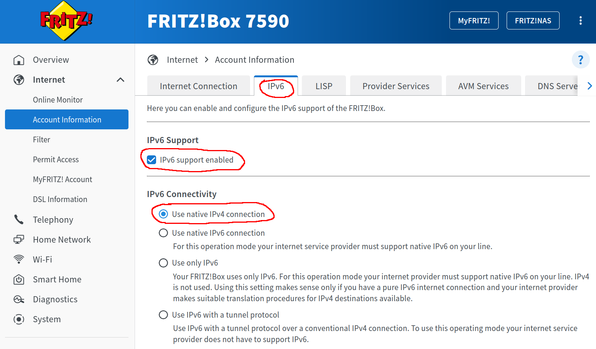
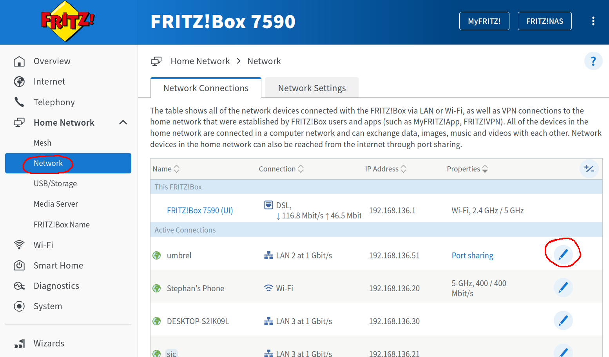
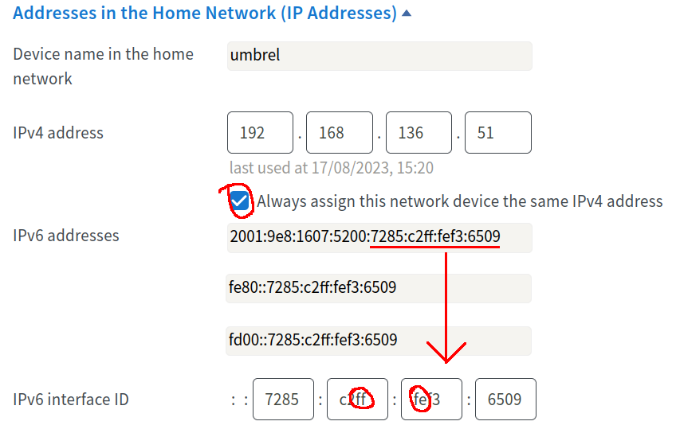

# Self hosting BTCPay Server

## The Problem
* Running your own Bitcoin node enhances privacy, security, and trust in the network by independently verifying transactions and rules without relying on third-party services.
* Some user-friendly options for running a Bitcoin node that may appeal to less technical users include
    1. **Umbrel**: A popular, easy-to-use software package that allows users to run a Bitcoin node.
    2. **Start9**: An all-in-one personal server solution, including Bitcoin and Lightning Network node capabilities.
    3. **RaspiBlitz**: A DIY Bitcoin and Lightning Node solution for Raspberry Pi.
    4. **MyNode**: Another user-friendly software package that runs on Raspberry Pi or other compatible hardware.
    5. **Nodl**: A plug-and-play Bitcoin full node product.
* **BTCPay Server** is an open-source payment processor that enables merchants to accept Bitcoin directly, without relying on third-party services. All of the options for running a Bitcoin node include BTCPay as an optional app.
* Reaching a self-hosted BTCPay Server from the Internet can pose several common challenges:
    1. **Firewall Configuration**: Incorrect firewall rules can block incoming connections to the server.
    2. **Port Forwarding Issues**: Necessary ports might not be properly forwarded from the router to the BTCPay Server.
    3. **Dynamic IP Addresses**: If the host’s IP address changes regularly, it can be difficult to consistently reach the server.
    4. **DNS Configuration**: Incorrect or misconfigured DNS settings can lead to problems in resolving the server's domain name.
    5. **SSL/TLS Certificate Problems**: Incorrectly configured or expired SSL/TLS certificates can cause security warnings or connection failures in browsers.
    6. **Reverse Proxy Configuration**: Misconfiguration in reverse proxy settings might lead to improper handling of incoming requests.
* This tutorial shows how to solve these issues.

## My configuration

I use the following configuration for the tutorial. Your setup may be different, but the general steps will be the same. I am based in Germany, so I will use mostly German providers and services:

* **ISP:** 100 MBit DSL from 1und1 (https://dsl.1und1.de)
    * Dual-Stack IPv4 and IPv6 (IPv4 had to be requested through customer service)
    * dynamic IP address and IPv6 prefix changing every 24 hours
* **Router / Firewall:** AVM FRITZ!Box 7590 AX (https://avm.de)
* **Bitcoin node:** Umbrel v0.5.4 (https://umbrel.com) 
    * Operating system: Ubuntu Server 22.04.3 LTS (GNU/Linux 5.15.0-78-generic x86_64) (https://ubuntu.com)
    * Machine: AMD Ryzen 5 3400G, 16 GB RAM, ASRock X570M Pro4, 2 TB Samsung 970 EVO Plus
    * Software: bitcoin v25.0, LND v0.16.4, Thunderhub v0.13.19, BTCPay Server v1.11.1
* **DynDNS Provider:** dynv6 (https://dynv6.com) - free
* **Domain Provider:** STRATO (https://www.strato.de) 
    * You only need the domain starting from 1€ per month
    * May include DynDNS support, depending on chosen package
* **SSL/TLS Certificate Provider**: Let's Encrypt (https://letsencrypt.org) - free

I assume that your Bitcoin node is already set up, Lightning channels are available and BTCPay Server is running. You have root access to your node through SSH. This tutorial only describes how to make BTCPay accessible from the internet in order to receive payments.

If you find this helpful, feel free to leave some sats at my self-hosted BTC-Pay Server: https://pay.rcane.eu. If you have feedback, drop me an email at firefly6602@rcane.eu.

## Step 1 - Router / Firewall Configuration

The following steps are specific to AVM FritzBox. However, you only need to enable port forwards to you Bitcoin node. This should be possible with almost all routers. The setup will be done for **dual-stack** operation supporting both, IPv4 and IPv6. IPv6 is a bit more advanced, but it is the future! However, you can omit the IPv6 part and only enable IPv4 if you wish.

1. Log in to your router (e.g. by opening a browser and typing "http://fritz.box")

2. **IMPORTANT**: Check for native IPv4 support! Go to "Internet - Account information - IPv6". You should have native IPv4 with IPv6 support enabled: <p align="center"></p>

    * If you do not have IPv4 support **STOP HERE**! 

    * Many ISPs  only supply an IPv6 address and use Dual Stack Lite (DS-Lite / DSlite) and provide access to IPv4 addresses using a AFTR gateway. In this case, you cannot forward IPv4 ports to your node and your node will not be reachable from IPv4.

    * I could quickly resolve this by calling customer support and having a plausible story of why I need IPv4 (e.g. that I was working from home and need to share files with customers through FTP, Nextclud etc.). I got it fixed in 20 minutes. If they refuse, consider changing your ISP or look for other options to host your node (e.g. Voltage https://voltage.cloud)

3. Edit your nodes settings at "Network - Network Connections" by clicking the edit button<p align="center"></p>

    * In the section "Addresses in the home network", enable "Always assign this network device the same IPv4 address"

    * Look for the IPv6 address and make sure that the last 4 fields match the ones in the "IPv6 interface ID"
    * [*IPv6*] **IMPORTANT**: Look out for the letters **ff:fe** in the middle of the interface ID. If they are there, it means that your node uses an EUI-64 IPv6 address generated from the MAC address of your ethernet card. Meaning: the interface-ID does not change, which is what we want! 

    * [*IPv6*] Desktop operating systems such as Ubuntu desktop, windows, etc. use so-called privacy extensions that generate random inferface-IDs every time you reboot the PC. In this case, you need to enable EUI-64 manually, but be aware that this will make it very easy to track your activity if you use your node for browsing the web. <p align="center"></p>

    * In the field "Further Device Information, you will find your nodes **MAC address**. Note this down, we will need it later.

4.  Go back to the main screen and go to "Internet - Permit Access - **Port Sharing**" Configure the following port forwards. Note that HTTP is only active for IPv4, but not IPv6. The reason is that IPv6 does not support network address translation and port 80 is already used by the node. We will only use IPv4 port 1080 to redirect to HTTPS. I would not recommend any other port forwards, such as SSH, since this creates an attack surface on your node. If you need to log in from the outside, you can use a private VPN connection such as Wireguard.
    * **bitcoin** - Protocol TCP, IPv4 and IPv6, Device port 8333, External port 8333
    * **HTTPS-Server** - Protocol TCP, IPv4 and IPv6, Device port 443, External port 443
    * **HTTP-Server** - Protocol TCP, **IPv4 only**, Device port 1080, External port 80
    * Under "IPv6 Settings", enable PING6

## Step 2 - DynDNS Setup

Since your IP address is always changing, we need to keep track of these changes to make your node reachable. There are many DynDNS services. The one that works best for me so far is dynv6 (http://dynv6.com). They are free, support IPv4 and IPv6 and do not spam you with advertisement.

1. Go to http://dynv6.com and sign up a new account. They only want an eMail address.
2. Go to "My Zones - Create a new zone"
3. Select a domain name. It does not matter which one since it will only be used to store your IP addresses. You will later connect to your BTCPay server through your real domain name using a CNAME redirect.
4. Go to your account on the top right and select "Keys". In the section "HTTP Tokens - Details", you will find your access token. Note this down.

Now you need to configure your node to periodically update the DynDNS record. In principle, your FritzBox (or another router) could do this. However, this was not reliable for me. I wrote my own update script in python which you can find in the folder ``dynv6_update_script``. This will run directly on your node. 

5. Edit the script ``update_dyndns.py`` in a text editor and set the variables ``domain``, ``token``, and ``notify_email``. (Also have a look at the code to verify that nothing malicious is done. Don't trust me, verify!)
6. Log into your node using SSH. For Windows, you can use putty (https://www.putty.org).
7. Copy the edited ``update_dyndns.py`` to your nodes home folder. You can use ``scp`` for linux command line or WinSCP (https://winscp.net) for Windows.
8. On your node, test the script by running the command ``python3 ~/update_dyndns.py``. The script will now compare your nodes IPv4 and IPv6 addresses with the ones registered at dynv6. If they differ, an update is triggered and an email is sent to you. If they are the same, the script will exit. You might need to install python and missing python packages in order to do so. I tried not to use anything fancy. The output should look like this:

```
umbrel@umbrel:~$ python3 ~/update_dyndns.py
Address update:
Domain:                firefly6602.dynv6.net
Timestamp (UTC):       2023-08-17 14:29:34.782640
IPv4 address (Domain): 89.245.211.248
IPv4 address (Host):   89.245.211.248
IPv4 status:           no update
IPv6 address (Domain): 2001:9e8:1617:5100:7285:c2ff:fef3:6509
IPv6 address (Host):   2001:9e8:1617:5100:7285:c2ff:fef3:6509/64
IPv6 status:           no update
```
9. Automatically run the script every 5 minutes by adding it as a cronjob. Edit the crontab by ``sudo nano /etc/crontab``. Then add the following line to the end of the file. Don't forget to change the username.
```
*/5 *   * * *   umbrel    python3 ~/update_dyndns.py
```

## Step 3 - DNS Configuration

As mentioned in the introduction, you will need a domain. This is the only thing you will need to pay for. If you already have a domain, you should be all set. If not, you could buy one for roughly 1 EUR per month e.g. at STRATO (https://www.strato.de). If comes with the added benefit of an email-provider which is not Google and where you can control the settings. 

I relied on the following resources for this part: 
https://community.umbrel.com/t/how-to-configure-umbrel-lnbits-app-without-tor/604

1. Log into your domain provider and create a new sub-domain for the domain that you bought. This will be used to access your BTC-pay server, so you could choose something like ``pay.lightning.com`` if you own the domain ``lightning.com``. 
2. Go to the DNS settings of the subdomain. There you will find an entry ``CNAME-Record``. Edit this entry and add domain name from the DynDNS provider. Put a dot in the end. In my above example, this would be ``firefly6602.dynv6.net.``
3. Test if it works by going to http://www.ipv6now.com.au and pinging your node from the outside. You should get a response in both, IPv4 and IPv6. It might take a while to propagate the changes, so try a few times if it didn't work right away.

Now we need to obtain a certificate for your subdomain from https://letsencrypt.org. With this you will be able to securely reach your BTCPay server using an HTTPS encrypted connection.

4. Log into your node using SSH.
5. Install certbot by ``sudo install certbot``
6. Run ``sudo certbot certonly --manual --preferred-challenges dns``
7. Certbot will ask you for the domain, and will also ask you to place a TXT record for ``_acme-challenge`` with a string it gives as the value. You have to do this on your domain provider (e.g. STRATO). For your subdomain there will be a setting "*TXT and CNAME Records*". Select this is add the ``_acme-challenge`` record with the given string by certbot.
8. On a linux command line, try to read the challenge by ``dig -t txt _acme-challenge.pay.lightning.com``. Dont forget to set the correct domain name. The same string should be returned that was given by certbot. It might take some time to propagate rhe data through the DNS network. If it worked, hit enter in the certbet session and your certificate will be issued.
9. Your new certificate should be under ``/etc/letsencrypt/live/pay.lightning.com/`` Remember this path as we’ll need it shortly.
10. Letsencrypt certificates expire after 3 months and need to be renewed. This can be automatically done by a cronjob. Edit the crontab by sudo nano /etc/crontab. Then add the following line to the end of the file.
```
21 21    * * *   root   certbot renew --deploy-hook "systemctl reload nginx"
```
This will run every day at 21 minutes past 9pm to check if your certifictes need to be renewed. If yes it will update the certificate and restart ``nginx``, the reverse proxy server that we will setup in the last step. (Of course you can run the cronjob at any time you like.)

## Step 4 - Reverse Proxy Configuration

In the last step, we will link your BTCpay Server to your subdomain. For this we will use ``nginx``. If you are curious how it works, watch https://www.youtube.com/watch?v=7VAI73roXaY&t. 

1. Log into your node using SSH.
2. Install nginx by ``sudo install nginx``
3. Navigate to ``/etc/nginx/sites-available/``
4. Create a new configuration file for your BTCpay by ``sudo nano btcpay``. Then edit the following content:
```
proxy_buffer_size          128k;
proxy_buffers              4 256k;
proxy_busy_buffers_size    256k;
client_header_buffer_size 500k;
large_client_header_buffers 4 500k;
http2_max_field_size       500k;
http2_max_header_size      500k;

map $http_upgrade $connection_upgrade {
    default upgrade;
    ''      close;
}

map $scheme $proxy_x_forwarded_ssl {
        default off;
        https on;
}

server {
        listen 443 ssl;
        server_name [---YOUR SUBDOMAIN----];

        access_log /var/log/nginx/btcpay-access.log;
        error_log /var/log/nginx/btcpay-error.log;

        ssl_certificate /etc/letsencrypt/live/[---YOUR SUBDOMAIN----]/fullchain.pem;
        ssl_certificate_key /etc/letsencrypt/live/[---YOUR SUBDOMAIN----]/privkey.pem;

        location / {
                proxy_pass http://127.0.0.1:3003/;
                proxy_set_header Host $host;
                proxy_set_header Upgrade $http_upgrade;
                proxy_set_header X-Forwarded-Proto $scheme;
                proxy_set_header X-Forwarded-Ssl $proxy_x_forwarded_ssl;
                proxy_set_header X-Forwarded-Port $server_port;
                proxy_set_header X-Real-IP $remote_addr;
                proxy_set_header Connection $connection_upgrade;
                proxy_http_version 1.1;
        }
}

server {
        listen 1080;
        server_name [---YOUR SUBDOMAIN----];
        return 301 https://[---YOUR SUBDOMAIN----]$request_uri;
}
```

5. You need to set your subdomin name, e.g. ``pay.lightning.com`` at each position where there is ``[---YOUR SUBDOMAIN----]``.
6. You need to set the correct port under ``location`` in the line ``proxy_pass http://127.0.0.1:3003/;``. Port 3003 is the port that Umbrel uses to access BTCPay server. If you use a different node, the port might be different. You find this in your browsers address line when you open BTCpay server locally.
7. Save the file and navigate to ``/etc/nginx/sites-enabled`` 
8. Create a link the the file by ``sudo ln -s /etc/nginx/sites-available/btcpay btcpay``
9. Restart nginx by ``sudo systemctl restart nginx``
10. Open your browser and access your subdomain. You should get a HTTPS encrypted connection to your BTCpay server.

However, there is an issue with Umbrel, that needs an additional step to work (see https://github.com/getumbrel/umbrel/issues/1428). Essentially, the btcpay Docker container in Umbreal comes with its own nginx server. So now, we have two chained nginx servers. This confuses BTCPay server and it refuses to work propertly. The solution is to tell BTCPay to trust the new nginx server. After Umbrel v0.5.1, you will need to add a small configuration change to BTCPay:

11. [Umrel only]: Add a file to your BTCPay configuration ``sudo nano ~/umbrel/app-data/btcpay-server/.env.app_proxy``. Add the following line:
```
PROXY_TRUST_UPSTREAM=true
```
12. Restart BTCPay server: ``sudo ~/umbrel/scripts/app restart btcpay-server``

